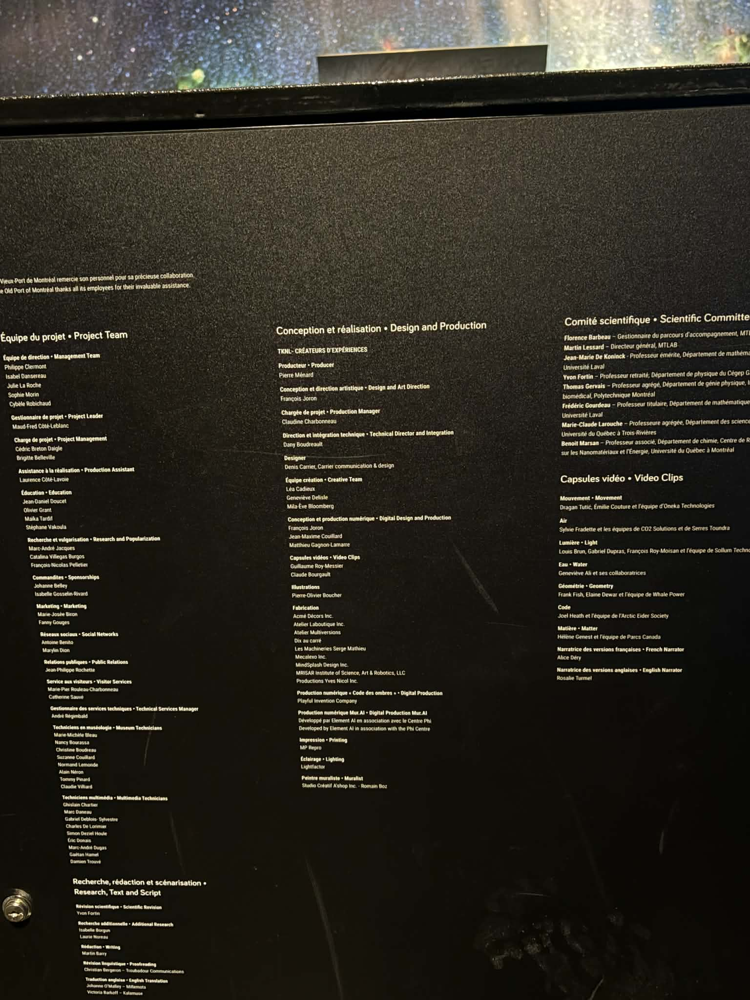
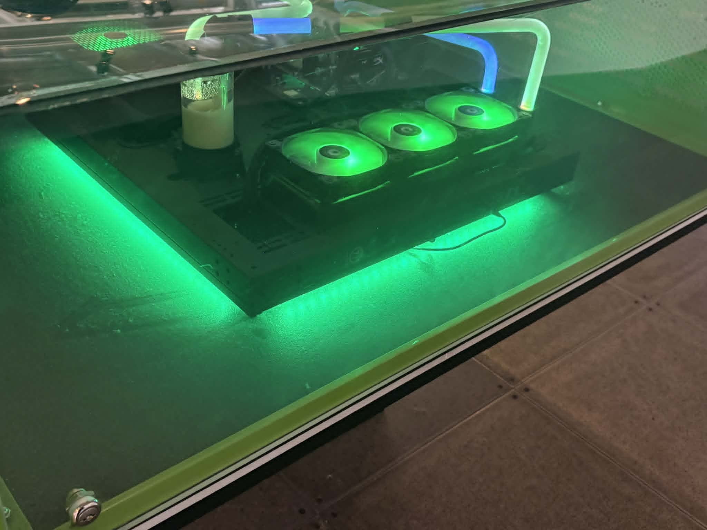
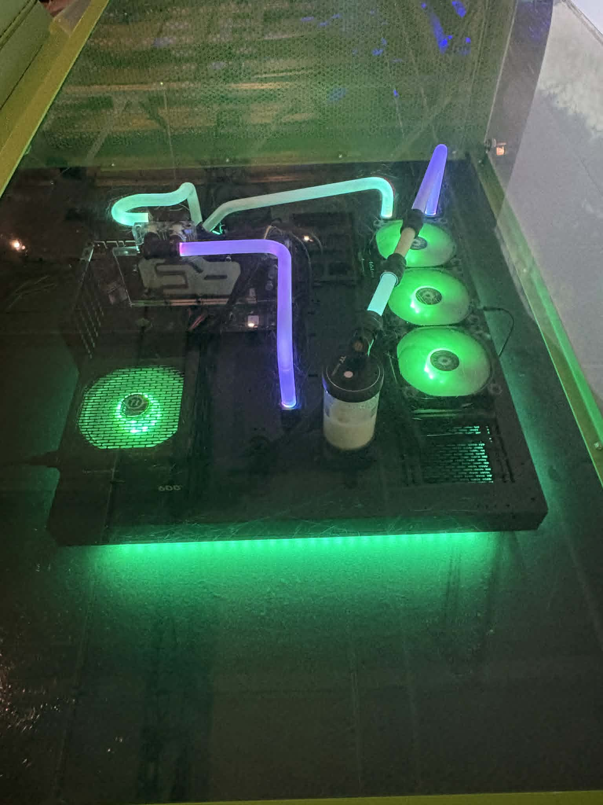
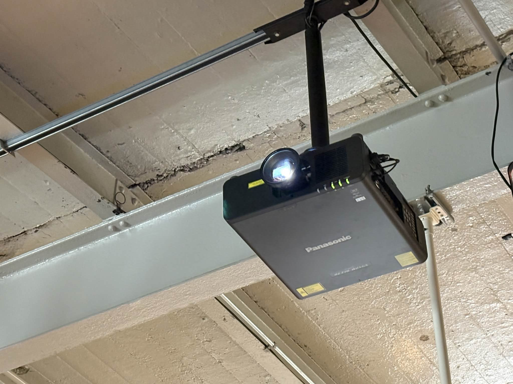
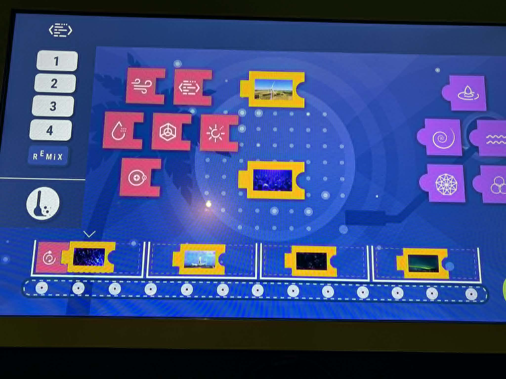
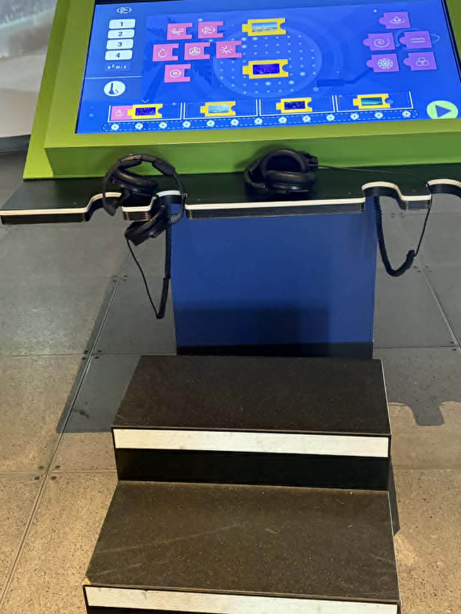
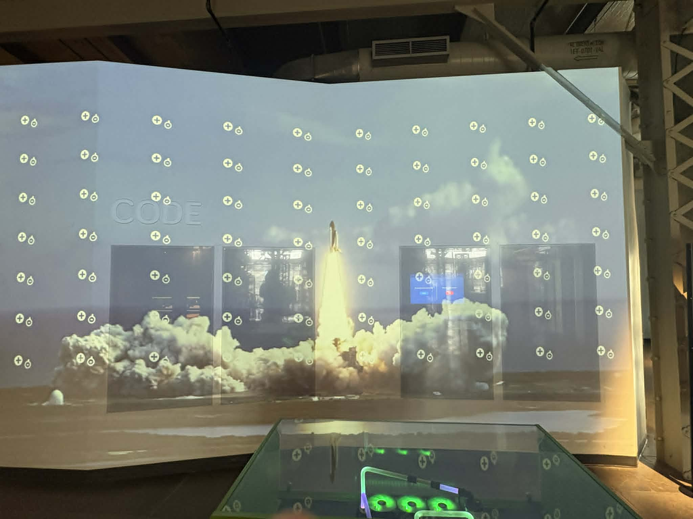
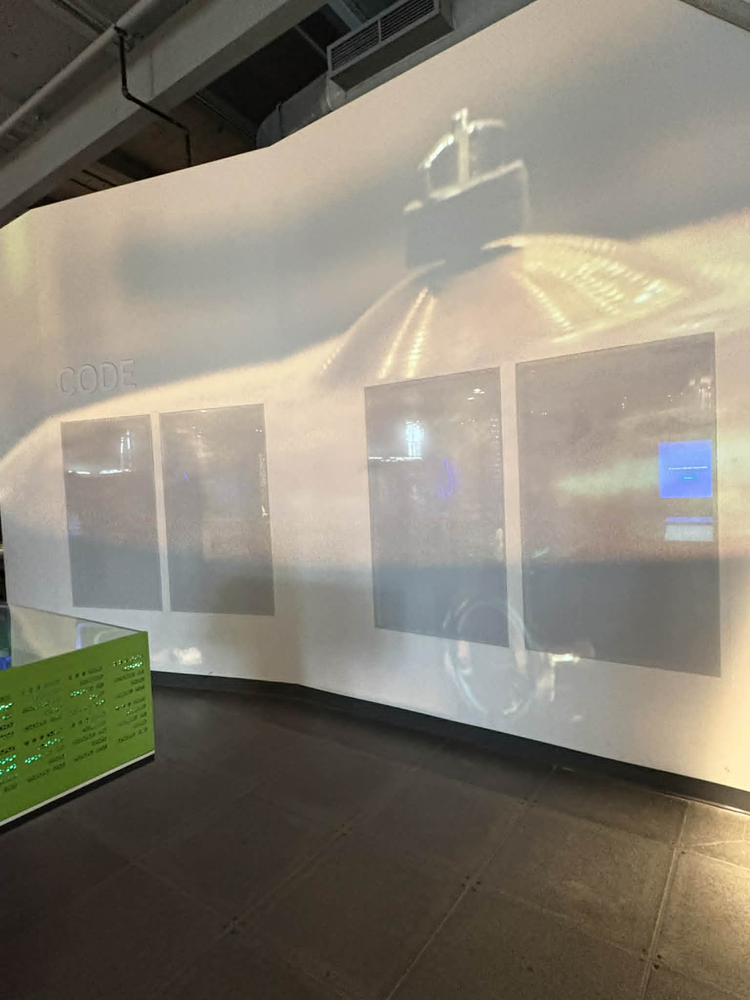

# La science en grand
## Centre des sciences de Montréal

>photo de moi devant l'entré , prise par Ahmed

## L'exposition est permanante et réalisée en intérieur

J'ai visité l'exposition le 12 avril 2026.

### Le dispotif qui m'a marqué est:  *La vidéo sous tous les angles*

> image qui montre le dispositif dans sa globalité, prise par moi 

## Les firmes

### Ceux qui ont réalisé ce dispositif ne sont pas vraiment crédité 

Mais ceux là on aidé à la conception de la pluspart des dispositif

> photo qui montre ceux qui ont financer et peut-être réalisé ce dispositif , photo prise par moi

  

  > photo montrant les crédits de tout les partenaires , photo prise par moi 

### l'année de la réalisation du projet 

on ne peut pas en être sur de la date de création de ce dispositif , mais ce qu'on sait c'est que l'année d'inauguration de "EXPLORE" est 2019.

## Description de l'oeuvre 

L’installation « La vidéo sous tous les angles » du Centre des sciences de Montréal est une table interactive qui permet aux visiteurs de manipuler des images pour comprendre comment on projette des vidéos sur des surfaces complexes (projection mapping).

## Type d'installation

Le dispositif choisi est intéractif

## Fonction du dispositif 

Le dispositif a pour but d’offrir une expérience pédagogique et interactive pour les jeunes, avec des explications simples à comprendre. Il utilise des interfaces colorées afin que les jeunes perçoivent l’activité comme un jeu et s’y investissent davantage.

## Mise en espace

## Composantes et techniques

Je n'ai pas de photo pour chaque composant ou techinques utlisé pour ce dispositf.

##  Composants techniques

Malheuresement je n'ai pas la référence des composant , mais c'est du matériel de qualité.

- **Ordinateur (unité centrale)**  
  PC performant avec carte graphique (GPU) pour traiter les images et gérer l’interaction.

  

  > Cette photo montre l'ordinateur et ces composant , photo prise par moi
  
  

   > Celle-ci montre l'ordinateur pris en plongé , photo également prise par moi

- **Projecteur vidéo**  
  Permet d’afficher les images sur une surface (mur, structure).
  
  

  > Image du projjecteur pris de dessous, photo prise par moi 
  

- **Logiciel de projection mapping**  
  Adapte les images aux surfaces complexes et synchronise les interactions.

- **Table tactile (interface utilisateur)**  
  Écran interactif permettant au visiteur de manipuler des éléments.

    

    > Écran nécessaire pour le projet , photo prise par moi 

- **Système audio**  
  Casques pour entendre les instructions ou les effets sonores.

    

    > Dans cette image on peut apercevoir les écouteurs, photo prise par moi.

- **Capteurs**  
  Détectent les actions de l’utilisateur (tactile ou mouvement).

- **Câblage et réseau**  
  Connexions (HDMI, alimentation, etc.) pour relier tous les composants.

- **écran**
  
  
> photo prise par moi

  

  > photo montrant le grand de coté , photo prise par moi.
  

 ## Les éléments nécessaire pour la mise en exposistion 
 
Voci le seul élément que j'ai vu: 

    
   
   > L'escabot est utile et nécessaire vu que la cible sont les enfants, photo prise par moi

    
##  Points forts
- Interface intuitive et facile à comprendre  
- Expérience interactive qui capte l’attention  
- Apprentissage ludique (on apprend en jouant)  
- Utilisation de technologies modernes (projection, tactile)  
- Accessible à un large public, surtout les jeunes  

##  Points faibles
- Peut être trop simplifié pour les utilisateurs avancés  
- Compréhension parfois limitée sans explications supplémentaires  
- Temps d’utilisation court si beaucoup de visiteurs  
- Dépendance à la technologie (pannes possibles)  

## Expérience vécue
- Interaction directe avec l’installation (manipulation sur écran tactile)  
- Sentiment de jouer tout en apprenant  
- Compréhension visuelle du fonctionnement du projection mapping  
- Expérience immersive et engageante  
