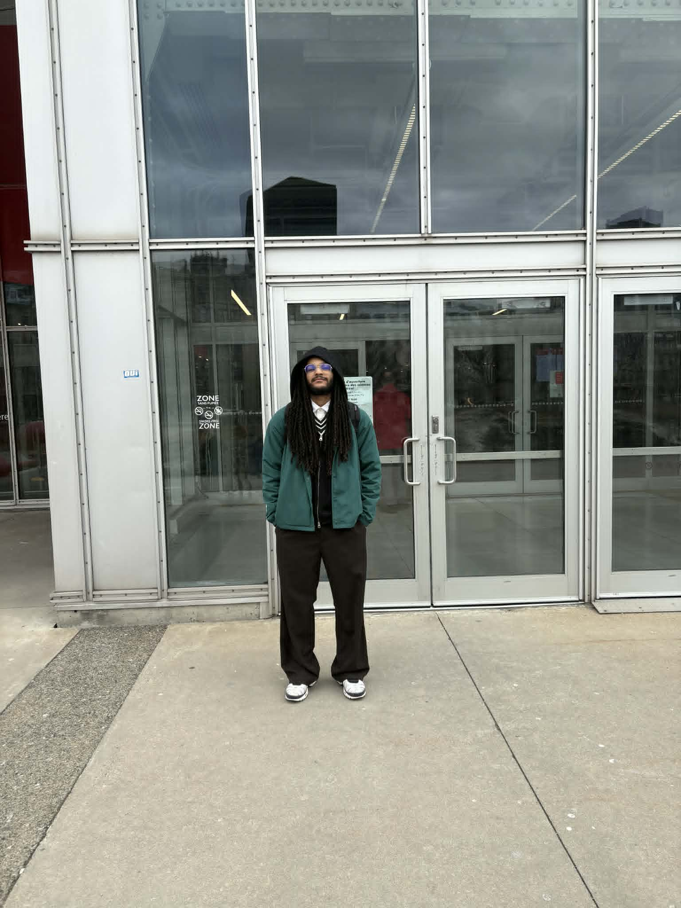
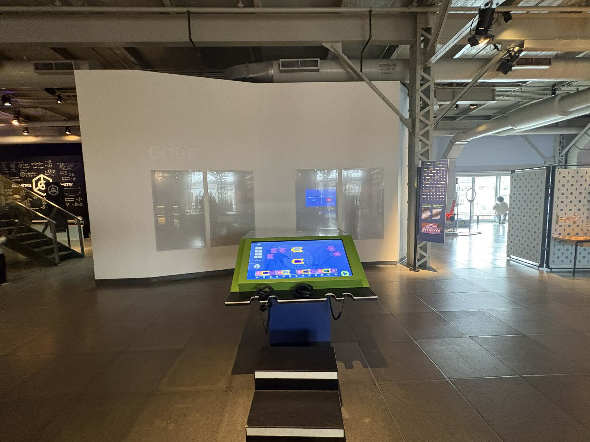
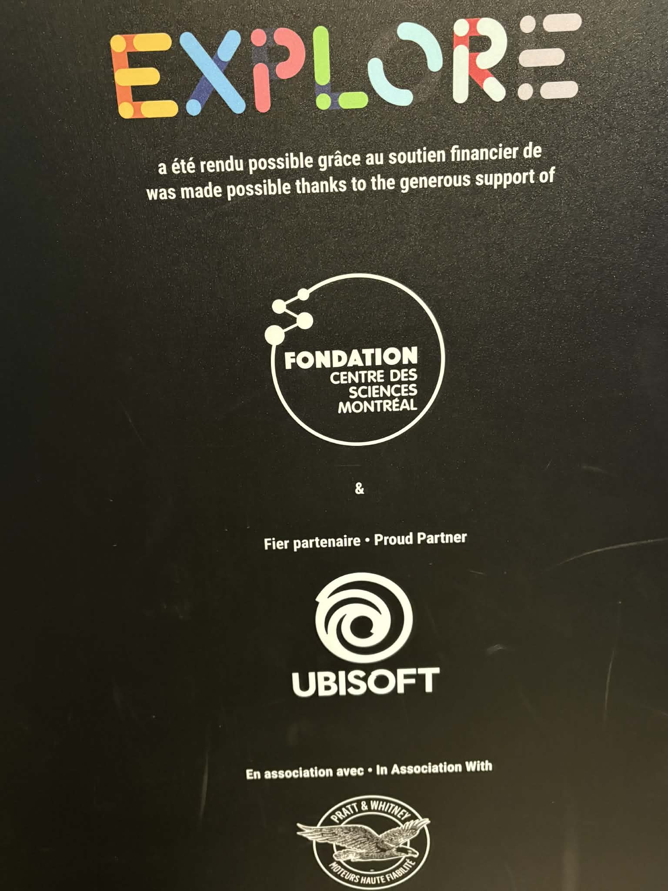
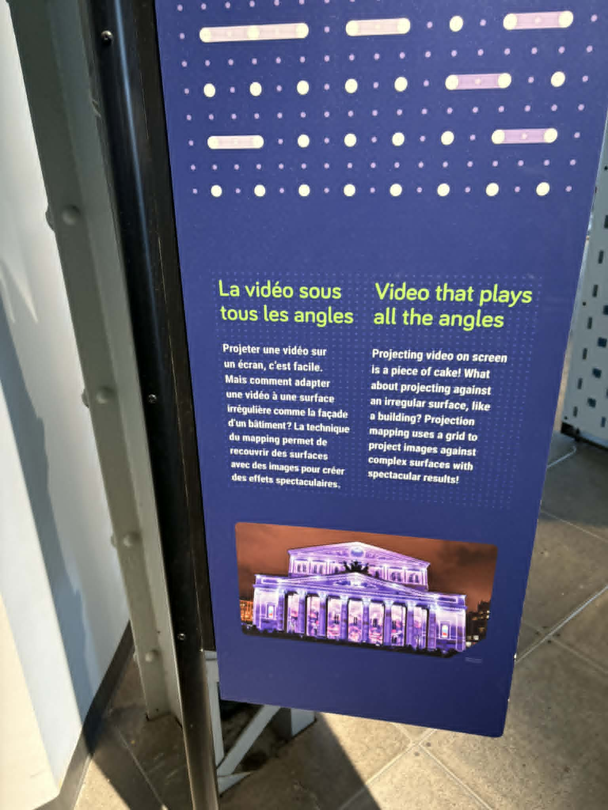
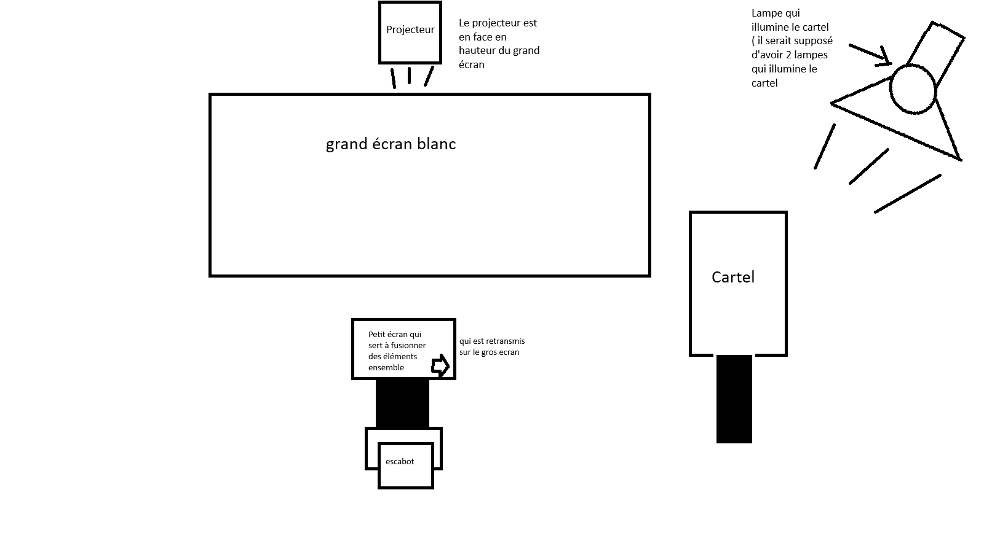

# La science en grand
## Centre des sciences de Montréal

>photo de moi devant l'entré , prise par Ahmed

## L'exposition est permanante et réalisée en intérieur

J'ai visité l'exposition le 12 avril 2026.

### Le dispotif qui m'a marqué est:  *La vidéo sous tous les angles*

> image qui montre le dispositif dans sa globalité, prise par moi 

## Les firmes

### Ceux qui ont réalisé ce dispositif ne sont pas vraiment crédité 

Mais ceux là on aidé à la conception de la pluspart des dispositif

> photo qui montre ceux qui ont financer et peut-être réalisé ce dispositif , photo prise par moi

### l'année de la réalisation du projet 

on ne peut pas en être sur de la date de création de ce dispositif , mais ce qu'on sait c'est que l'année d'inauguration de "EXPLORE" est 2019.

## Description de l'oeuvre 

L’installation « La vidéo sous tous les angles » du Centre des sciences de Montréal est une table interactive qui permet aux visiteurs de manipuler des images pour comprendre comment on projette des vidéos sur des surfaces complexes (projection mapping).

## Type d'installation

Le dispositif choisi est intéractif

## Fonction du dispositif 

Le dispositif est pour but de faire une expérience pédagoqique et intéractif pour les jeunes avec des explications simples à comprendre , en utilsant des interfaces de couleurs pour que les jeunes voient ça comme un jeu et qu'ils s'investient.

## Mise en espace

## Composantes et techniques

Je n'ai pas de photo pour chaque composant ou techinques utlisé pour ce dispositf.

 ## Les éléments nécessaire pour la mise en exposistion 
 

## Expérience vécue

Justement j'ai pris ce dispositif même s'il n'était pas parfait il prenait en compte notre satisfaction en compte , c'est un jeu qu'il faut toujours battre son score et le score des autres avec des défis en suivant un certains rythme. 
J'ai trouvé cela vraiment bien en considérant que c'est un projet d'école donc avec un temps très limité.

## Les Points fort

POur revenir sur les points fort , Le fait qu'on a un objectif qui est de battre notre score précédent , alors ça rajoute de la dynamique et une envie de s'investir

## Les points faibles

Malheuresement , par moment c'était pas assez précis , le fait de faire retourner le vase pour verser l'eau avec un capteur , et il fallait pas la dépasser la jauge qui montrait sur l'écran,  à certain moment ce n'était pas assez précis. Si non à part ça je vois pas vraiment de problèmes.

  

  > photo de comment on joue , prise sur leur site
  
  

  
  > photo de comment on joue , prise sur leur site
  
  
  
  > photo de ce qu'on voit quand on joue , photo prise moi
