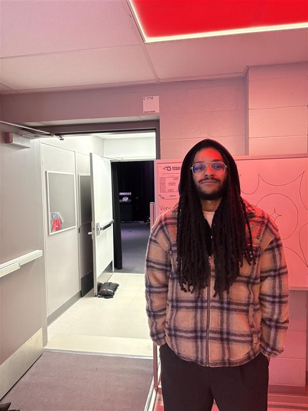
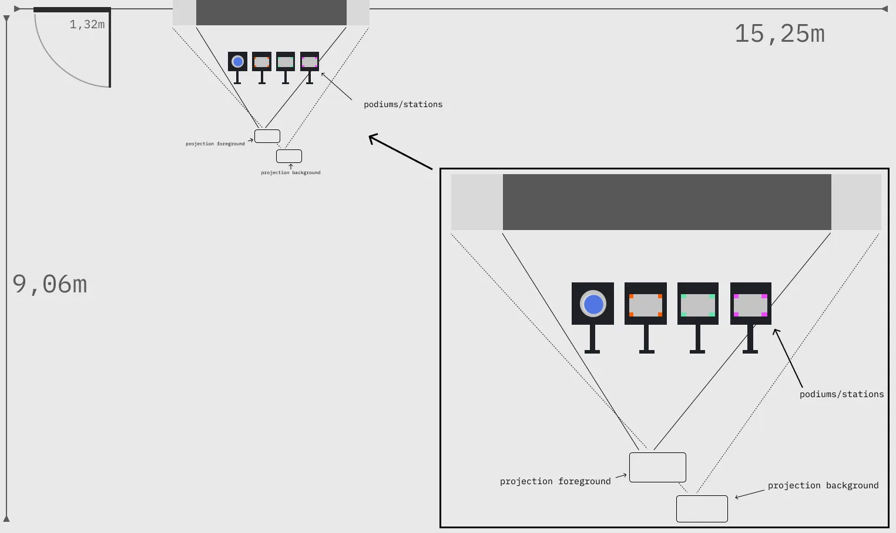
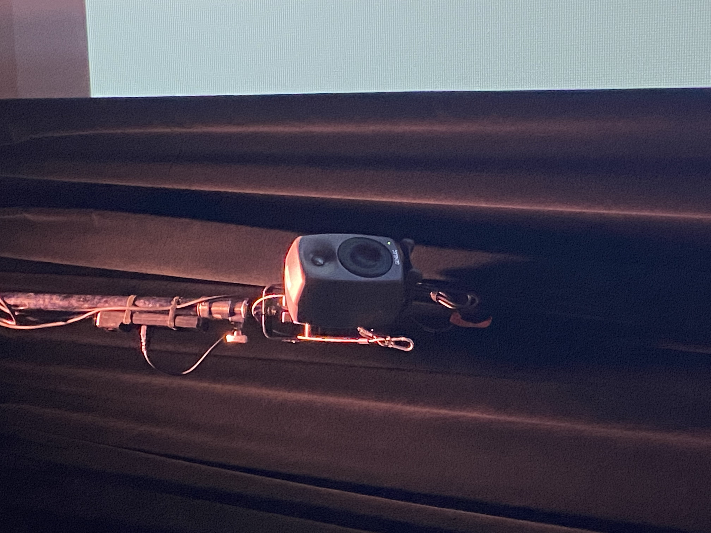
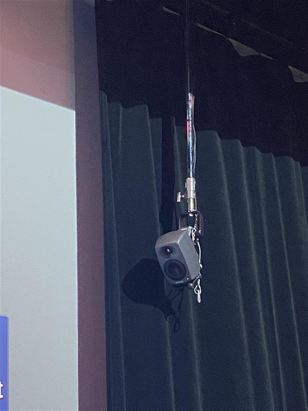
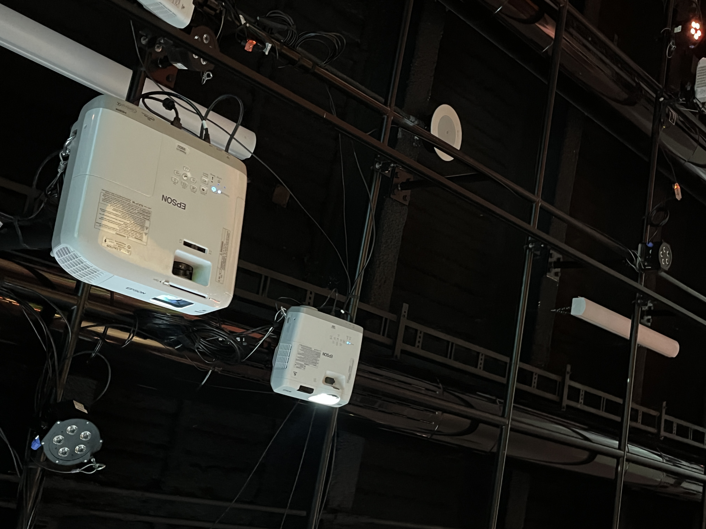
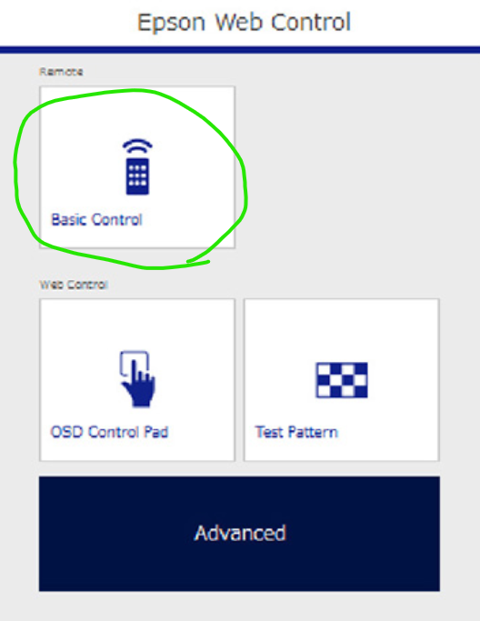
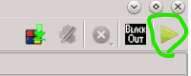

# Réseau vivant 

>Photo du nom de l'expostion, prise par Anne-Julie

>photo de moi devant l'entré , prise par Walid C
>
## L'exposition est temporaire et réalisée en intérieur
J'ai visité l'exposition le 24 Fevrier et 17 Mars.

### Le dispotif qui m'a marqué est **SYMBIOSE**

## Équipe
### Ceux qui ont réalisé cette oeuvre sont appelés les CHIMISTES 

Yannick Chamberland 

> Photo de Yannick, trouvée sur leur site : https://les-chimistes.github.io/symbiose/#/equipe/
> 
Benjamin Ferland

>Photo de benjamin , trouvée sur  leur site : https://les-chimistes.github.io/symbiose/#/equipe/
>
Ryan Dufault  

>Photo de Ryan , trouvée sur  leur site : https://les-chimistes.github.io/symbiose/#/equipe/
>
Walid Cheour 

>Photo de Walid trouvée sur  leur site : https://les-chimistes.github.io/symbiose/#/equipe/
>

### l'année de la réalisation du projet est 2026 
pour le cadre d'un travail de fin de programme au Cégep montmorency.

## Description de l'oeuvre 

Symbiose est une expérience interactive où les participants manipulent une potion chimique virtuelle. À travers différentes stations dédiées (eau, feu, poudres, tourbillon), ils doivent collaborer pour contrer des événements imprévisibles qui déstabilisent le mélange. Leur défi : préserver l’équilibre de la potion aussi longtemps que possible.

## Type d'installation

Le dispositif choisi est intéractif

## Fonction du dispositif 

Le dispositif est pour but de faire une expérience pédagoqique qui retrace les connaissances acquise durant leur techninque.

## Mise en espace

> photo du croquis pris sur leur site

## Composantes et techniques

Je n'ai pas de photo pour chaque composant ou techinques utlisé pour ce dispositf.

### Audio

- 2 haut-parleurs actifs de 5"-
-  2 fils XLR conducteurs de 15'
- Carte de son multi-sorties + adaptateur powerCON

> photo du haut parleur , prise par Ahmed

> photo du deuxieme haut parleur , prise par Ahmed

### Vidéo

- 2 projecteurs Epson PowerLite 990U
- 1 câble HDMI

> phot du projecteur, prise par moi ( Alexandre)

> photo de l'application pour lancer les projecteurs et les synchrconiser , photo sur leur site

### Lumière

- 1 lumières LED RGBAW DMX (une par station)
- 1 fils XLR conducteurs de 20'
- 1 Interface DMX Via XLR
- LEDs i2c pour brûleur

### Électricité

- 4 extensions électriques

 ### Réseau
 
- 3 câbles ethernet
- 1 transmetteurs et 1 récepteurs (pour projection)

### Ordinateurs

- 1 ordinateur portable (avec cable alimentation)

### Matériaux de fabrication

- 1 planche de plywood 2 par 4 1/4" ; Pour stations feu et poudres et tourbillon lors de maquette #2
- Visserie et quincaillerie
- Tissus bleu semi-transparent pour intérieur erlen meyer

### Capteurs et contrôleurs

- 3 M5Stack ATOM PIOE pour transmission de données ethernet
- 2 M5Stack Pbhub pour grouper les units
- 6 M5Stack Key Unit
- 1 M5Stack Angle Unit
- 1 M5Stack ATOMS3
- 1 Joystick analogique X-Y
- 1 Arduino Nano

### Objets physiques
- 1 Erlenmeyer 500ml
- 1 Knob de 30mm avec shaft de 6mm (pour fixer sur angle unit)
- 3 Boutons style arcade 60mm (station poudres) (vert bleu blanc)
- 
### Logiciels Requis

- Visual Studio Code / PlatformIO / Arduino IDE (Programmation des capteurs: accéléromètre, knobs, joystick)
- Unity 3D (Scène globale, réception données)

  

  > Cette photo montre commment le logiciel (Unity) fonctionne et à quoi le logicel ressemble avec leur projet dedans, photo prise sur leur site : https://les-chimistes.github.io/symbiose/#/exposition/ 
  
### Design graphique / Effets visuels

- After Effects (Effets de particules pré-rendus au besoin)
- Photoshop (Textures pour le laboratoire 3D)
- Blender/Maya (Modélisation 3D)
- TouchDesigner (Arrière plan de la seconde projection)

  

  > Photo du logiciel touch desinger , prise sur leur site

### Gestion de l'éclairage

- QLC+ (Éclairage)

### Audio
- Reaper / FL Studio (Composition et design sonore)
- Synthétiseurs VST (Sons de laboratoire, événements  

> Tout les références de l'équipement , les logiciels et autres ont été trouvé sur leur site. J'ai gardé la même hierarchie car je ne pouvais pas faire plus clair. 

 ## Les éléments nécessaire pour la mise en exposistion 
 
ici quelques photos pour illuster les éléments nécéssaire pour que le dispostif et le resltat escompter fonctionne :

> Photo qui montre  l'écran , Photo prise pas Ahmed

> Ceci illustre des bechers , des sortes de vase qui sert pour l'interactivité , photo prise par Ahmed

> celle-ci montre sur quoi sont les éléments avec lequel on joue. photo prise par Anne-Julie

> Une vue global ou qu'on aperçoit un blouson pour l'immersion d'un scientifique qui joue avec des potions, photo prise par Anne-Julie

## Expérience vécue

Justement j'ai pris ce dispositif même s'il n'était pas parfait il prenait en compte notre satisfaction en compte , c'est un jeu qu'il faut toujours battre son score et le score des autres avec des défis en suivant un certains rythme. 
J'ai trouvé cela vraiment bien en considérant que c'est un projet d'école donc avec un temps très limité.

## Les Points fort

POur revenir sur les points fort , Le fait qu'on a un objectif qui est de battre notre score précédent , alors ça rajoute de la dynamique et une envie de s'investir

## Les points faibles

Malheuresement , par moment c'était pas assez précis , le fait de faire retourner le vase pour verser l'eau avec un capteur , et il fallait pas la dépasser la jauge qui montrait sur l'écran,  à certain moment ce n'était pas assez précis. Si non à part ça je vois pas vraiment de problèmes.
