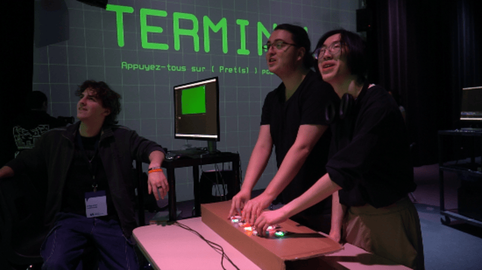
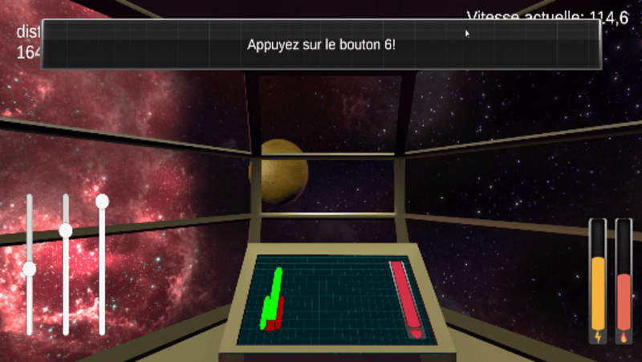
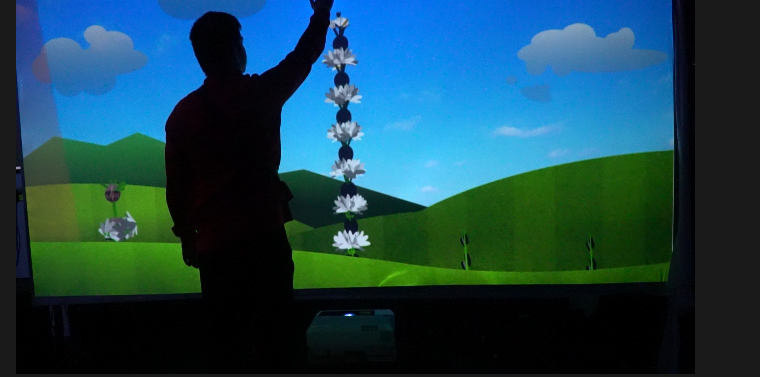
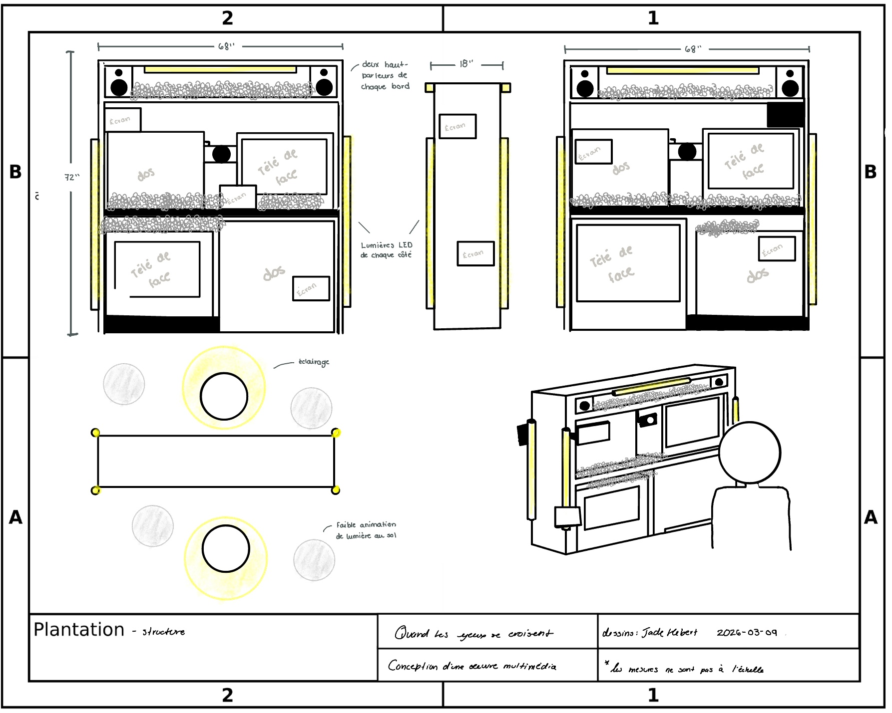
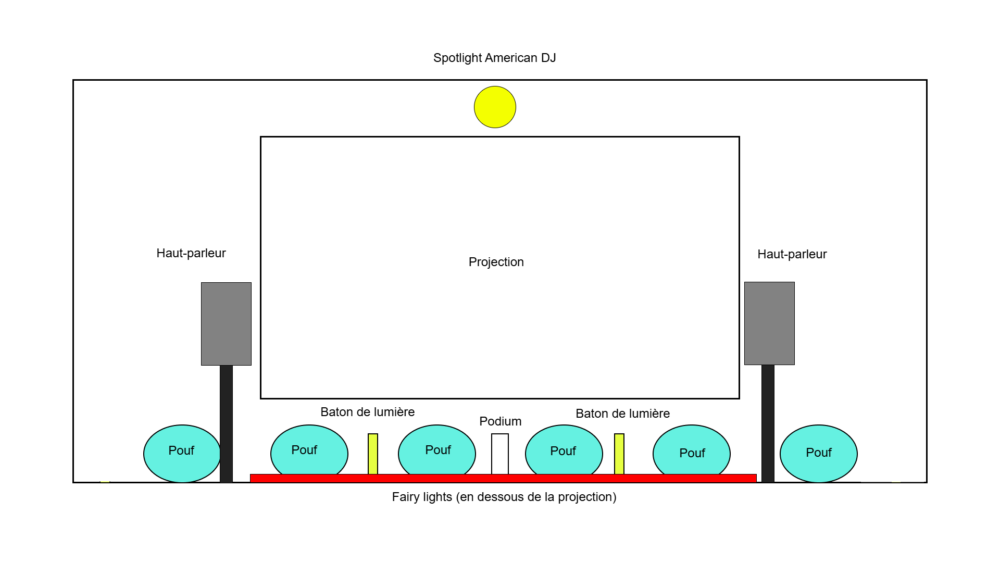

# Mission décollage

## Leur site : https://o-i-g-n-o-n.github.io/Mission-decollage/#/

## L'équipe

- Ahmed Kaissoumi

- Radhouane Kordan

-  Justin Montpetit

- Thearylou Lach

- Jad Saloumi 

## Installation en cours (ou finale)

> photo de comment est situé le dispositf , photo prise sur leur site

> image qui retranscris ceux que faisaient ceux d'en l'image d'en haut , photo prise sur leur site

## Schéma de l'installation prévue

> image qui montre le croquis de l'installation , photo trouvée sur leur site : https://o-i-g-n-o-n.github.io/Mission-decollage/#/technique/

### J'ai adoré faire vivre cet expérience , il y avait un vrai défi et c'était amusant et jai possé beacoup de question sur les enjeux qu'ils ont eu en réalisant leur projet et ils m'ont expliqué comment ils ont fait pour connecter tout leur truc ensemble et c'était très intéressant et j'ai appris des choses que normalement je ne devrais pas savoir à mon niveau actuel. 

# Arbre-en-Face

## Leur site : (https://mammouths.github.io/projet/#/)

## l'équipe:

- Alexandre Gendron

- Mikael Arseneau

- Mathieu Willet
  
- Matis Ghariani
  
- Rafael Angon Dubé

## Installation en cours (ou finale)

> photo de l'installation , vu global , prise sur leur site .

## Schéma de l'installation prévue

> photo de l'implantation fait en 2D , trouvée sur le site dans la section technique .

 ### Au début je ne comprenais pas le projet , mais dès que j'ai commmencé à m'informer sur comment ça fonctionne , par rapport au codage et commment ils font pour capturer des photos de nous ,le projet est devenue d'un seul coup passionnant.
 
# Quand les yeux se croisent

## Leur site : https://emersiaa.github.io/Quand-les-yeux-se-croisent/#/

## L'équipe 

- Edelwyn Ledru
  
- Félix Lavoie
  
- Jade Hébert
  
- Manel Yaya
  
- Patricia Nassif

## Installation en cours (ou finale)

> Image de l'installation , vu global du dispositif , trouvée sur leur site.

## Schéma de l'installation prévue

> image du croquis du dispostif , prise sur leur site dans la section " technnique".

### Après avoir expérimenter celui-ci je ne comprenais pas vraiment c'était quoi le but , donc j'ai posé des question et c'était assez captivant donc j'en suis sorti finalement avec un bon avis. Surment parce que le visuel était vraiment beau.

# terminal

## Leur site : https://pythons-5.github.io/Terminal/#/

## Installation en cours (ou finale)

> Image qui représente l'installation fini et global de leur dispositif, trouvé sur leur site.

## Schéma de l'installation prévue

> La photo illustre le croquis du dispositif , trouvée sur leur site dans la section "technique".

### Quand on rentre dans le studio l'un des premiers dispositifs qu'on remarque c'est celui-ci , mais contre tout attende ce n'est pas le plus divertissant car c'est beacoup trop répetitif. Donc, j'en ai parlé avec les créateurs et ils en étaient conscient ce qui m'a  fait changer d'avis , car enfaite ils ont été très/trop ambitieux pour le nombre de temps qu'ils avaient.

# Océan Rouge

## Leur site : https://deux-intelligence.github.io/deux-neurones/#/

## l'équipe 

- Kristy Moussally

- Amira Tounekti

## Installation en cours (ou finale)

> photo montrant à quoi ressemble leur dispositif

## Schéma de l'installation prévue

> photo montranr le croquis , prise sur  leur site dans la section technique

### Celui-ci j'avais des gros doutes car c'est celui que je trouve le beau , mais l'expérience était tout de même sympa. J'aurais préférer un projet un peu plus aboutit . Hélas elle étaient que deux.

## Par rapport au cheminment de la formation TIM 

### Quand je penses au programme TIM ce que je constate c'est qu'il faut plusieurs compétences pour arriver à faire ce qu'ils ont fait par exemple : 

- la Modélisation 3D
 
- Conception d’une expérience multimédia
  
- Interactivité ludique

### Il y a une technique que je ne connaissais pas , qui à été utilisé sur quasiment tout les projets c'est : Pure data. Pure Data est enfaite un language qui aide à relier et contrôler des éléments ensemble audio ou vidéo qui est connecté avec le résaux ethernet.

> j'ai utilisé wikipédia pour m'aider à comprendre ce que c'est " Pure Data " : https://en.wikipedia.org/wiki/Pure_Data

