# -27,7C
## Une traversée sonore au coeur de l'Artique 
>inpsirée par l'expédition de Molécule
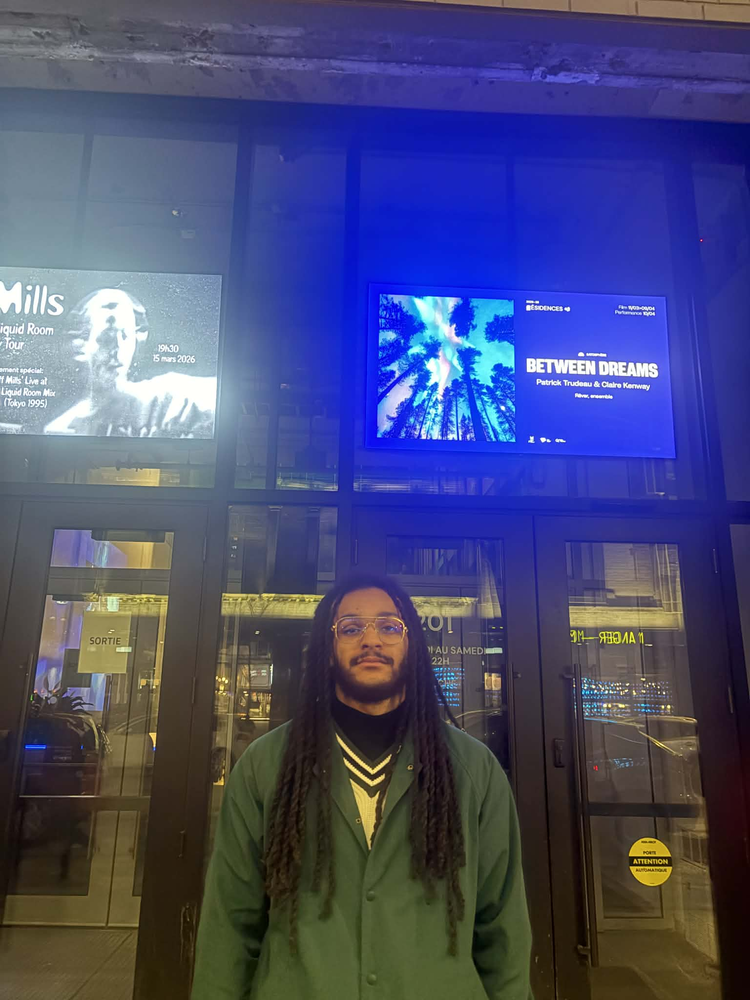

>Photo de moi devant l'entrée de la SAT ,prise ma copine
>
### Visite le 4 mars à 17h30

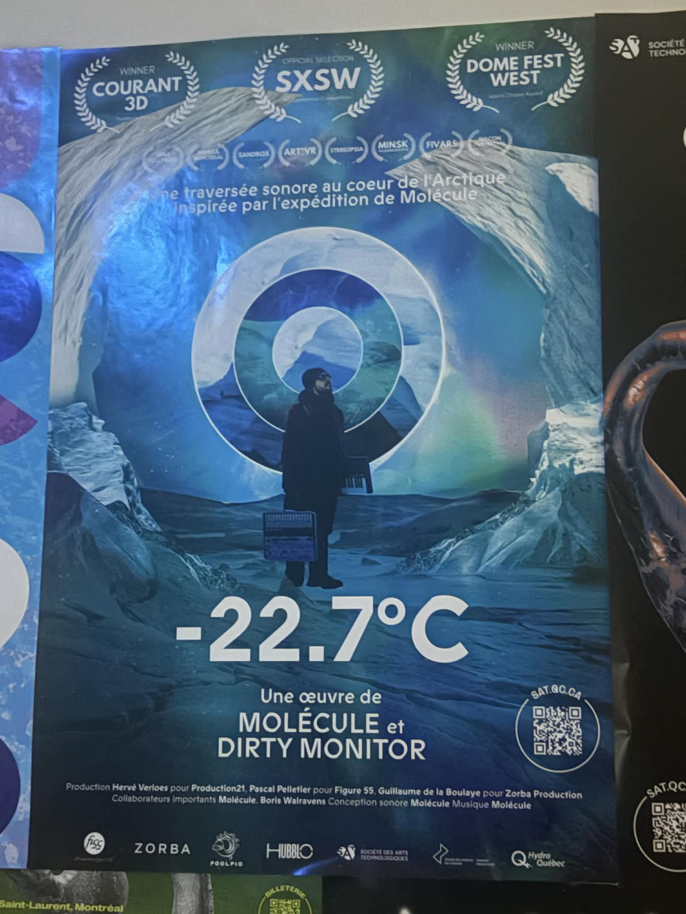

>photo de l'affiche, photo prise par moi

## l'exposition est temporaire
Film de 45min sans compter la bande-annonce du début.

l'Expostion se situais à la SAT ( science des arts technologiques) 

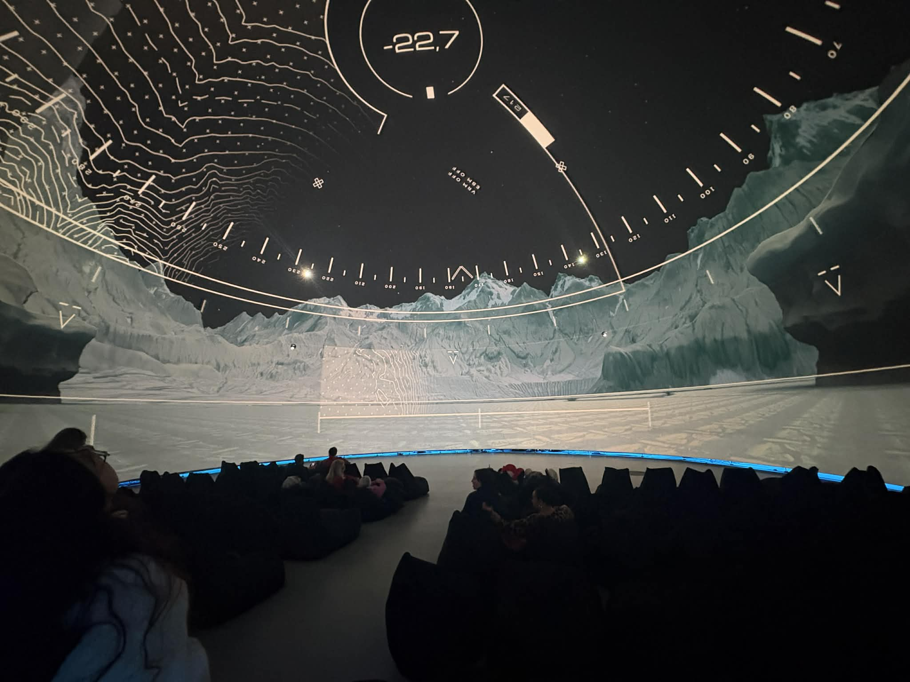

>Photo de la salle ou le film se situe, photo prise par moi

## Oeuvre de Molécule et Dirty monitor

>photo de Molecule, photo trouvée sur https://hubblo.ca/227c/

Molécule, le nom de scène de Romain De La Haye, est un musicien électronique français. Il est souvent considéré comme un pionnier de la musique électronique nomade, car il réalise des expéditions de field recording dans différents lieux comme l’Atlantic Ocean, le Arctic Circle ou encore les plages du Portugal. Lors de ces voyages, il enregistre les sons naturels et les ambiances du lieu pour les intégrer ensuite dans ses compositions musicales.

>photo de Dirty MOnitor, photo trouvée sur https://hubblo.ca/227c/

Le directeur artistique est le studio Dirty Monitor, une entreprise basée en Belgique. Ce studio créatif est reconnu comme un pionnier dans la conception et la production de contenus pour le mapping vidéo, ainsi que pour différentes réalisations audiovisuelles innovantes

## Description Du film 

### date de réalisation 2019

-22.7°C est une expérience immersive inspirée de l’aventure du musicien Molécule. En 2017, il s’est isolé pendant cinq semaines à Tiniteqilaaq, au Greenland, pour enregistrer les sons de l’Arctic et créer son album -22.7°C.

L’expérience plonge le spectateur dans un voyage sensoriel où les paysages arctiques, les sons naturels et des univers virtuels en 3D imaginés par Jan Kounen et Amaury La Burthe se combinent pour montrer le processus de création musical

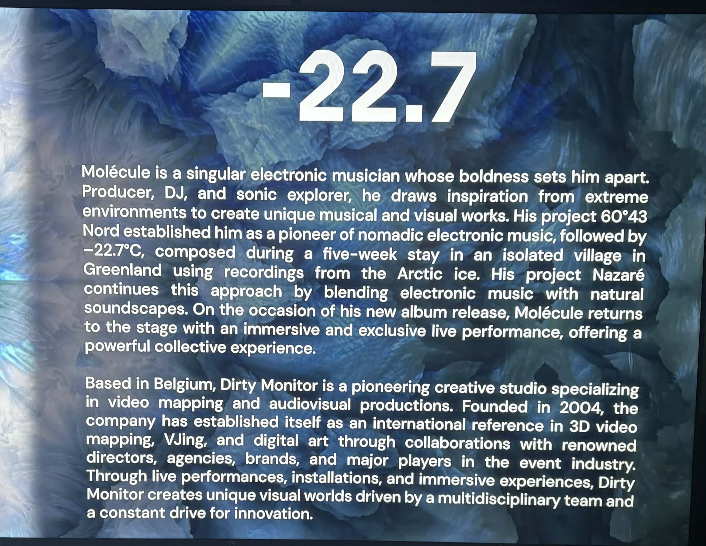

>texte qui étais devant l'entrée de la salle, photo prise par moi

## Le type d'installation est immersive et contemplative 
c'est les deux car le fait que ça soit dans une sphère de 360 degrés rend le l'oeuvre vraiment immersif , deplus il y a des haut-parleurs autour de nous.
Mais il ne faut pas oublier que le but premier est d'observer et d'écouter, donc le ceci est tout autant contemplatif.

## La fonction du dispositif

L’œuvre **-22,7°C** utilise des projections visuelles et du son pour créer une **expérience immersive**. Le dispositif multimédia sert de **scénographie** en transformant l’espace et en faisant imaginer au spectateur le froid et les paysages d’hiver. Il permet aussi de **mettre en valeur le thème du climat et de l’environnement**.

## Mise en espace

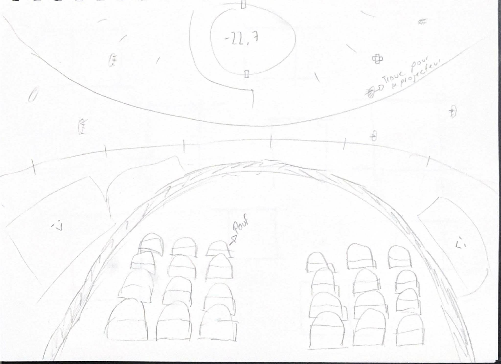

>Croquis de la mise en espace

Ce que vous voyez c'est un sphère , la ou que c'est écris -22,7 est le plafond , et en face est les coté se sont un mur blanc ou que les images apparaissent. les petit ovale sur les murs et le toit ,ce sont des projecteur (il yen a beacoup plus) 
ce que vous voyez au millieu se sont des poufs.

## Composantes et technique de l’œuvre -22,7°C

* Projections vidéo / images numériques
* Animation graphique
* Musique et effets sonores
* Espace immersif autour du public

* Projection numérique (mapping ou projection 360°)
* Animation et design visuel réalisés par Dirty Monitor
* Son spatialisé dans le dôme de la Société des arts technologiques

L’œuvre utilise des **projections numériques, des animations visuelles et un son immersif** pour créer un environnement autour du spectateur grâce aux technologies du dôme de la SAT.

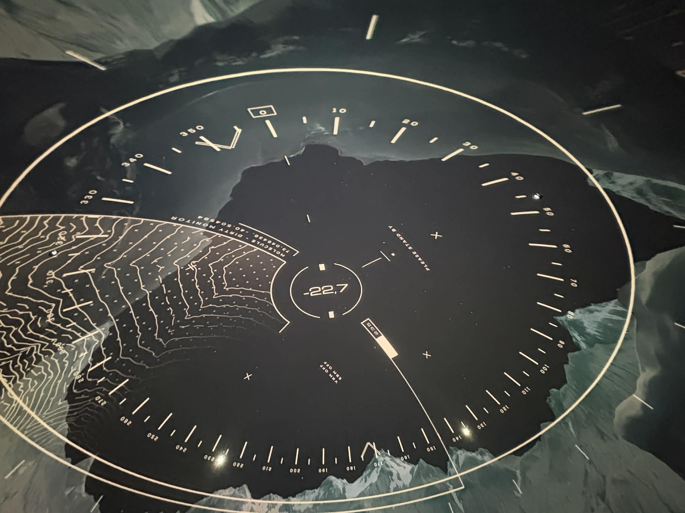

>Image qui montre le haut de la sphère pour démontrer les détails , et le niveau de complexiter  , photo prise par moi

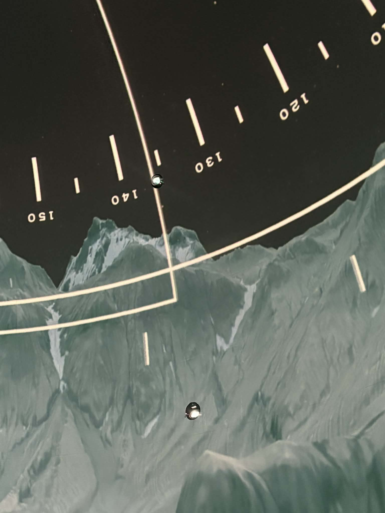

>Image montrant les projecteurs mis dans les murs, photo prise par moi

*93 haut-parleur au total*

## Éléments nécessaires à la mise en exposition:

* Mur blanc qui forme une sphère
* des poufs
* un  rideau noir

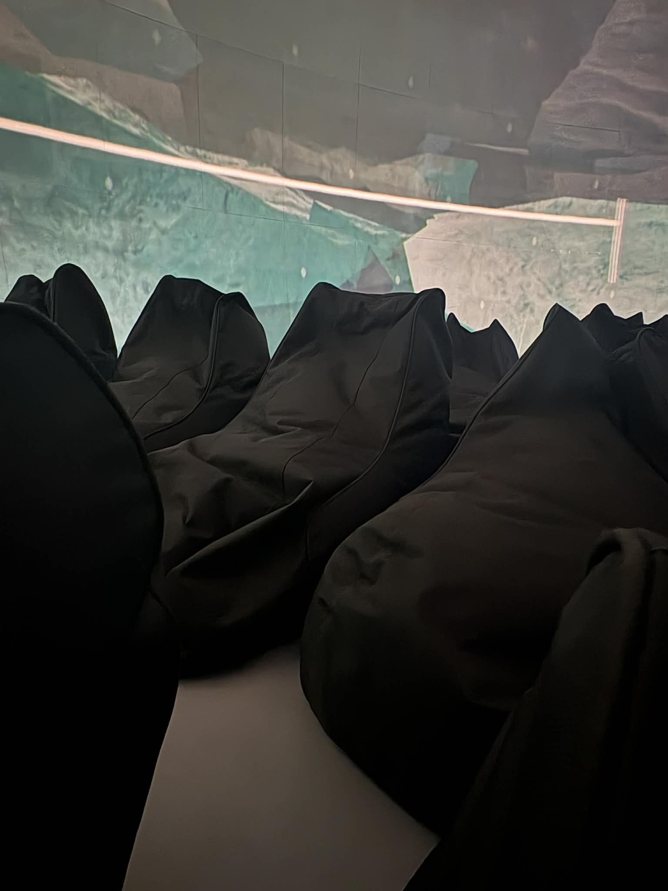

>Image montrant des poufs , mis pour le confort des specatateurs

## Expérience vécue 
J'ai eu de la difficutlé à rentrer dans le film , je trouvais ça long. Or, je ne peux pas nier que c'etait beau les images qui passaient ... mais un peu moins pour la musique.

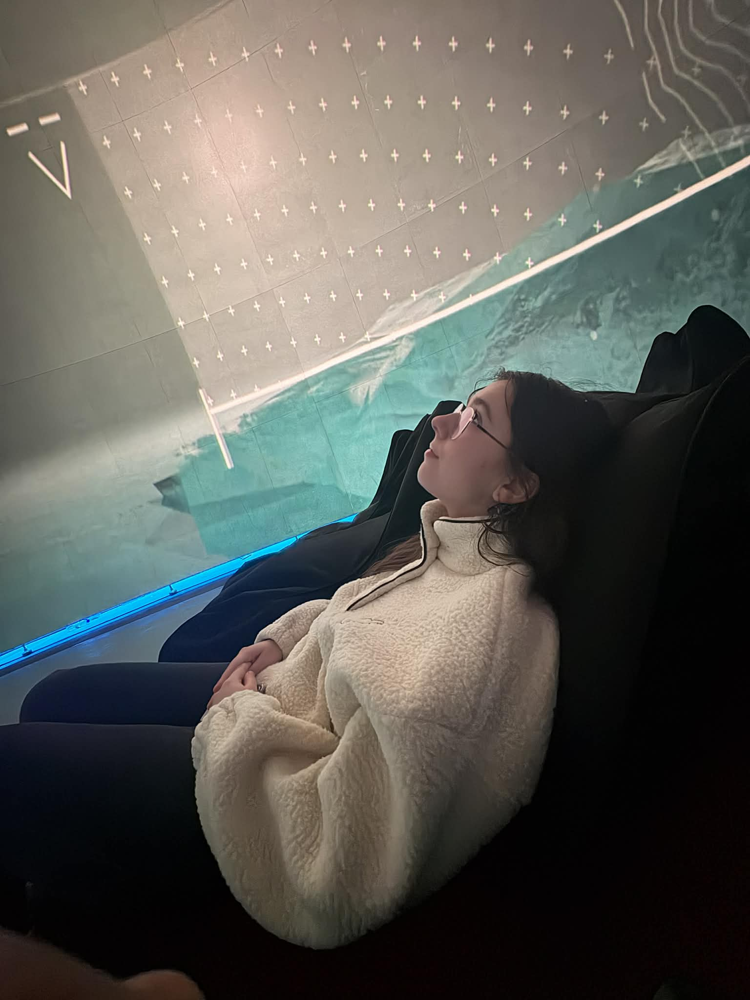

>Photo montrant ma copine qui regarde les images qui passent

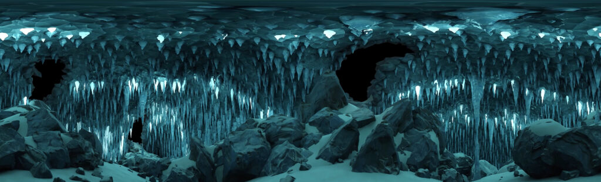

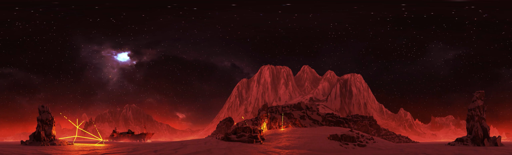

>Exemples d'images , trouvée sur https://hubblo.ca/227c/

## Ce que j'ai aimé et ce que j'ai moins aimé

Comme dis plus tôt j'ai bien aimer les images et les animations 3D mais par exemple la musique et certain effets sonores mon moins plus.
Globalement c'était bien, mais comme on dit ce n'est pas un *NO SKIP* 
