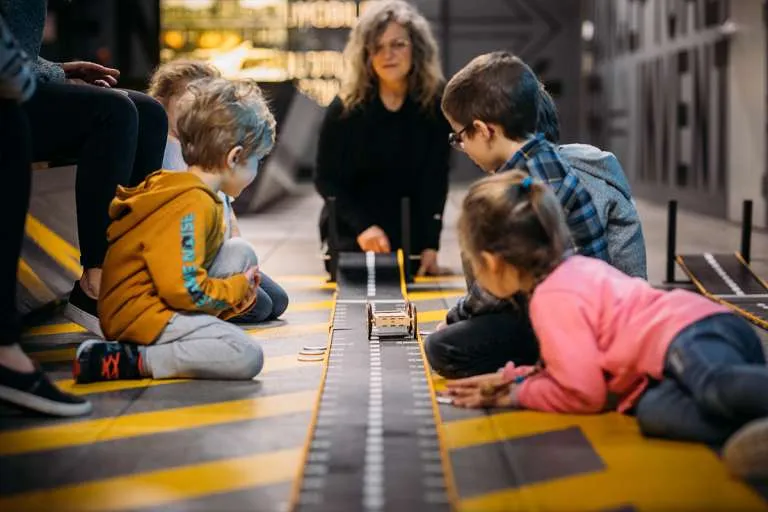

# Compte rendu – Rencontre avec M. Boucher (Musée de l’Ingéniosité)

## Présemtatiom

Lors de cette conférence, M. Boucher, technicien (et pas que ) multimédia au Musée de l’Ingéniosité, a présenté son parcours et les différentes facettes de son métier. Il a d’abord expliqué avoir suivi des études universitaires liées au son, avant de travailler comme motion designer. Il a notamment réalisé des contenus visuels pour des entreprises comme St-Hubert et pour le Musée des beaux-arts, avant de se diriger vers le domaine muséal.

## Ce qu'ils font ?

M. Boucher travaille aujourd’hui au sein d’une petite équipe de trois personnes. Son rôle est très polyvalent et demande plusieurs compétences techniques. Il doit maîtriser le codage, la programmation, ainsi que les systèmes électroniques et les câblages. Il possède également des connaissances en électricité, essentielles pour gérer les installations lumineuses et interactives.

Dans le cadre de son travail, il participe à la mise en place de dispositifs multimédias dans le musée. Il est responsable de la création d’activités interactives destinées au public, qu’il conçoit avec son équipe de A à Z. Ces installations sont comparables à celles du Centre des sciences de Montréal, où les visiteurs peuvent interagir avec la technologie.

De plus, il joue un rôle important dans les spectacles présentés au musée. Bien qu’il ne crée pas les contenus, il s’occupe de leur diffusion en gérant le son, les lumières et les caméras avant, pendant et après les représentations. Il est aussi responsable de l’ensemble des écrans et télévisions du musée.

## Appéciation

Cette conférence m’a permis de mieux comprendre la diversité du métier de technicien multimédia. J’ai particulièrement apprécié la polyvalence du poste et l’importance des compétences techniques. Cela montre que ce domaine demande à la fois créativité et rigueur, ce qui le rend très intéressant.

> chapeau_roue.webp, photo trouvé sur leur site, montrant une activité interactive avec des enfants : https://activites.museebombardier.com/activites-scolaires/sur-les-chapeaux-de-roues/

> stand_interactif.jpeg , photo prise par Francois, Sylvie, montrant un station interactif dans le cadre du multimédia.
